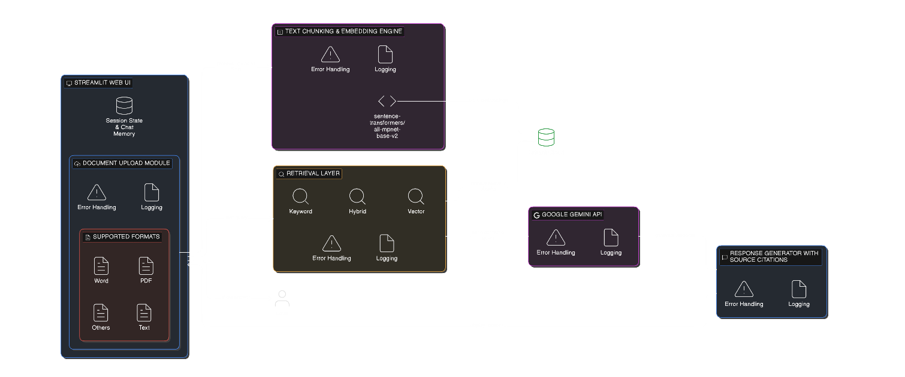
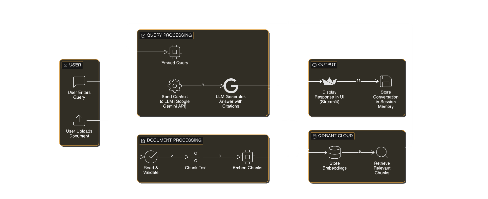
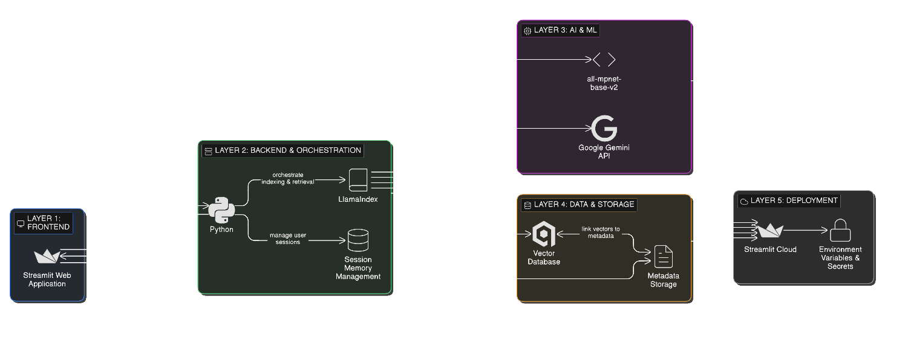
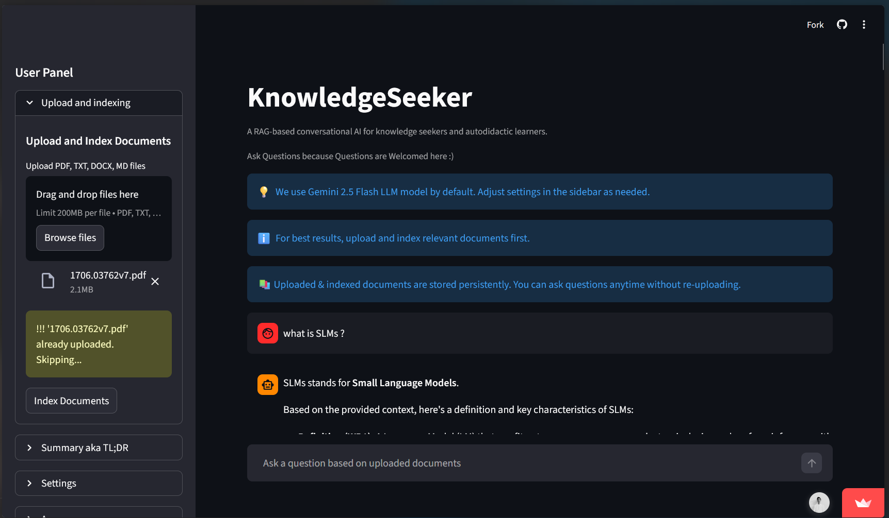
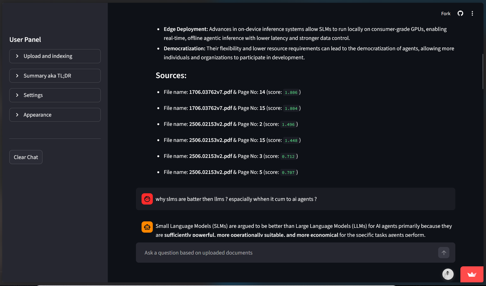
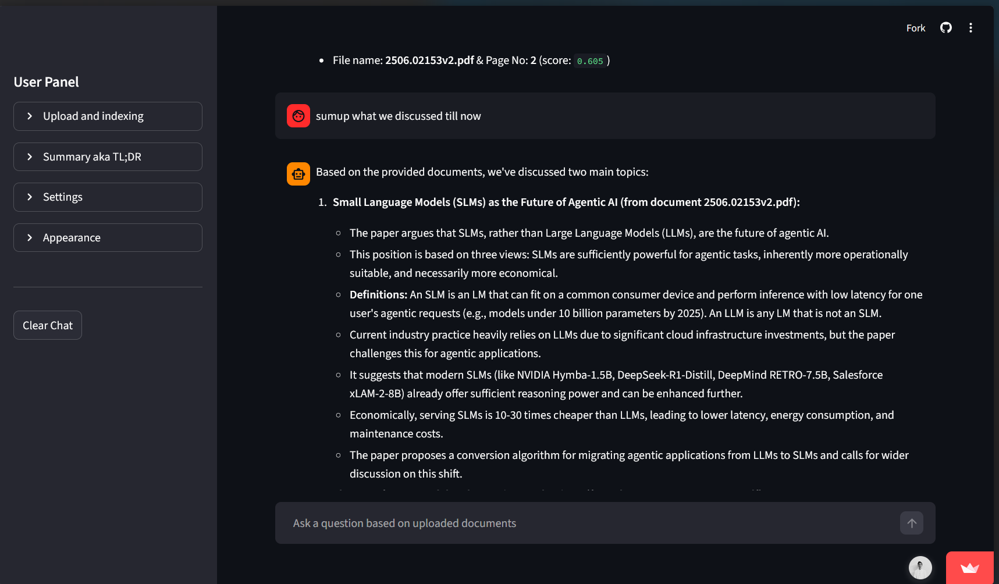
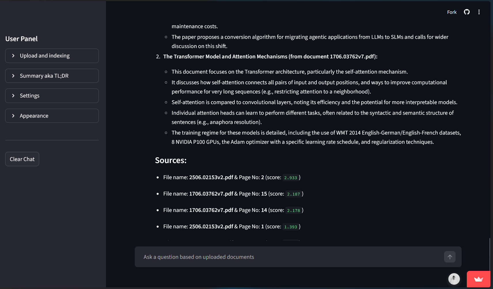
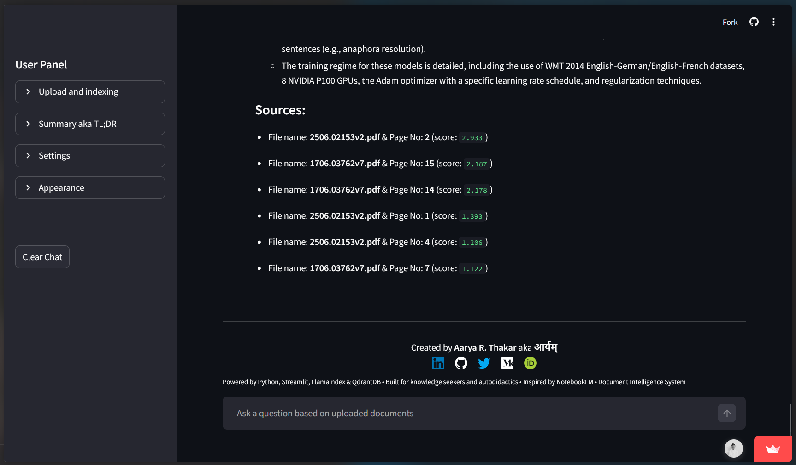
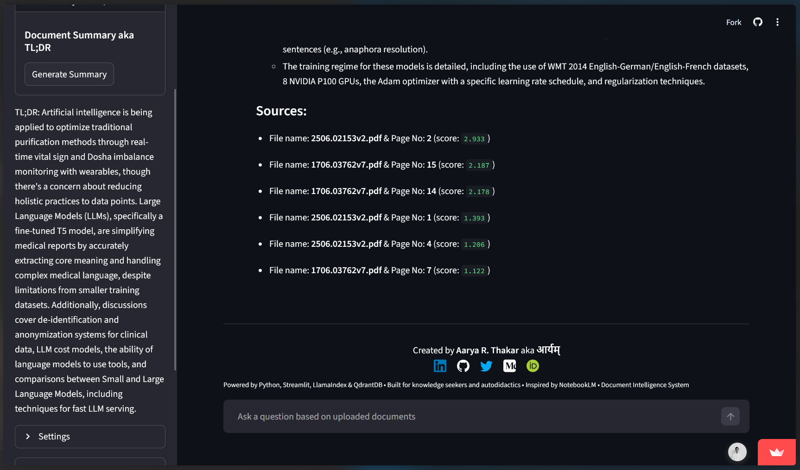
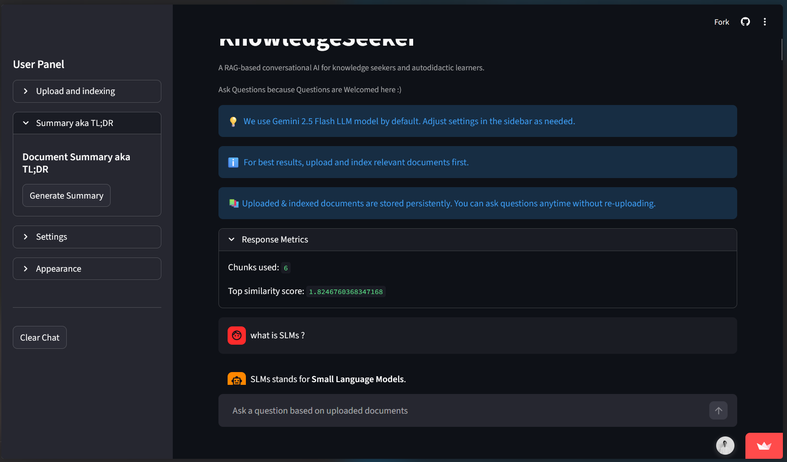

# Internship Report of Knowledge Seeker Chatbot

**AI-Based Document Search and Knowledge Retrieval with Conversational Interface**

---

**Intern:** Aarya R. Thakar  
**Program:** Infosys Springboard Virtual Internship 6.0  
**Project Duration:** Milestone 1-4  
**Submission Date:** February 09, 2026  
**Deployment Platform:** Streamlit Cloud  
**Vector Database:** Qdrant DB  

---

## Table of Contents

1. [System Overview](#1-system-overview)
2. [Deployment Details](#2-deployment-details)
3. [Evaluation Results](#3-evaluation-results)
4. [Observations & Limitations](#4-observations--limitations)
5. [Future Improvements](#5-future-improvements)
6. [Conclusion](#conclusion)
7. [Repositories Links](#repository-links)

---

# 1. System Overview

## 1.1 Project Summary

The Knowledge Seeker Chatbot is a Retrieval-Augmented Generation (RAG) based conversational AI system designed to help autodidactic learners and knowledge seekers find accurate answers from their uploaded documents. Unlike general-purpose chatbots that may hallucinate information, this system grounds all responses in user-provided documents, ensuring factual accuracy and relevance.

**Key Features:**
- Multi-format document support (PDF, TXT, DOCX and MD)
- Different search methodologies such as Hybrid Search, Keyword Search and Vector (Semantic and Similarity) Search
- Context-aware conversational interface
- Session-based chat memory for follow-up questions
- Automatic model switching on rate limits
- File deduplication using hashing
- User can control Temperature (Top-P) and Top-K chunks for the Creativity and answer Length.
- Users can Summarise their uploades documents in Single click.

---

## 1.2 Architecture Diagram

```
┌─────────────────────────────────────────────────────────────────────┐
│                          USER INTERFACE                              │
│                       (Streamlit Web App)                            │
└────────────────────────────┬────────────────────────────────────────┘
                             │
                             ▼
┌─────────────────────────────────────────────────────────────────────┐
│                     APPLICATION LAYER                                │
├─────────────────────────────────────────────────────────────────────┤
│                                                                       │
│  ┌──────────────┐    ┌──────────────┐    ┌──────────────┐          │
│  │   Document   │    │     RAG      │    │   Session    │          │
│  │   Processor  │───▶│    Engine    │◀───│   Manager    │          │
│  └──────────────┘    └──────────────┘    └──────────────┘          │
│         │                    │                    │                  │
│         │                    │                    │                  │
│         ▼                    ▼                    ▼                  │
│  ┌──────────────┐    ┌──────────────┐    ┌──────────────┐          │
│  │  Chunking &  │    │   Query      │    │   Chat       │          │
│  │  Indexing    │    │  Processing  │    │   History    │          │
│  └──────────────┘    └──────────────┘    └──────────────┘          │
│         │                    │                                       │
└─────────┼────────────────────┼───────────────────────────────────────┘
          │                    │
          ▼                    ▼
┌──────────────────┐    ┌──────────────────┐
│  EMBEDDING LAYER │    │   LLM LAYER      │
├──────────────────┤    ├──────────────────┤
│                  │    │                  │
│  HuggingFace     │    │  Google Gemini   │
│  Embeddings      │    │  - 2.5-flash     │
│  (sentence-      │    │  - 2.5-flash-    │
│   transformers)  │    │    lite          │
│                  │    │  (Auto-switch)   │
└────────┬─────────┘    └────────┬─────────┘
         │                       │
         ▼                       ▼
┌─────────────────────────────────────────┐
│         STORAGE LAYER                    │
├─────────────────────────────────────────┤
│                                          │
│  ┌────────────────┐  ┌────────────────┐ │
│  │  Qdrant Cloud  │  │   Streamlit    │ │
│  │  Vector Store  │  │  Session State │ │
│  │                │  │                │ │
│  │  - Embeddings  │  │  - Chat msgs   │ │
│  │  - Collections │  │  - Index ref   │ │
│  │  - Metadata    │  │  - File hashes │ │
│  └────────────────┘  └────────────────┘ │
│                                          │
└──────────────────────────────────────────┘
```



---

## 1.3 Technologies Used

### **Core Framework**
| Technology | Purpose | Version/Model |
|------------|---------|---------------|
| **LlamaIndex** | RAG orchestration, document indexing | Latest |
| **Python** | Primary programming language | 3.12.12 |

### **Vector Database**
| Technology | Purpose | Configuration |
|------------|---------|---------------|
| **Qdrant** | Vector storage and similarity search | Cloud cluster |
| **Docker** | Local Qdrant development | Latest |

### **AI Models**
| Component | Model/Service | Details |
|-----------|---------------|---------|
| **LLM** | Google Gemini 2.5-flash | Primary model |
| **LLM Fallback** | Google Gemini 2.5-flash-lite | Auto-switch on rate limits |
| **Embeddings** | HuggingFace sentence-transformers | sentence-transformers/all-mpnet-base-v2 (768-dim) |

### **Web Framework**
| Technology | Purpose | Features Used |
|------------|---------|---------------|
| **Streamlit** | Frontend interface | Chat UI, file upload, session state |

### **Deployment Infrastructure**
| Service | Purpose | Configuration |
|---------|---------|---------------|
| **Streamlit Cloud** | Application hosting | Free tier, auto-deploy from GitHub |
| **Qdrant Cloud** | Vector database hosting | Free cluster with 4GB storage |

### **Development Tools**
- **Conda** - Environment management
- **Git/GitHub** - Version control
- **Docker** - Local containerization
- **VS Code** - Development IDE
- **Nano and Vim** - File Editors
- **OS** - Ubuntu (WSL)

---

## 1.4 RAG Pipeline Explanation

### **Phase 1: Document Ingestion & Indexing**

**Step 1: Document Loading**
- User uploads documents through Streamlit interface
- Supported formats: PDF, TXT, DOCX and MD.
- LlamaIndex `SimpleDirectoryReader` extracts text content

**Step 2: Text Chunking**
- Documents split into smaller chunks for processing
- Configuration:
  - Chunk size: 512 tokens
  - Overlap: 51 tokens (preserves context across boundaries)
- Overlap ensures important context isn't lost at chunk boundaries

**Step 3: Embedding Generation**
- Each text chunk converted to 768-dimensional vector
- HuggingFace `sentence-transformers/all-mpnet-base-v2` model
- Embeddings capture semantic meaning of text

**Step 4: Vector Storage**
- Embeddings stored in Qdrant vector database
- Each vector indexed with metadata (source document, chunk position)
- Enables fast vector search at query time

---

### **Phase 2: Query Processing & Response Generation**

**Step 1: User Question Input**
- User types question in natural language
- Question stored in session state for conversation memory

**Step 2: Query Embedding**
- User question converted to 768-dimensional vector
- Same embedding model as documents ensures compatibility

**Step 3: Similarity Search**
- Qdrant performs vector similarity search
- Uses cosine similarity to find most relevant chunks
- Returns top-K most similar chunks (typically K=6)

**Step 4: Context Assembly**
- Retrieved chunks assembled into coherent context
- Includes source metadata for attribution

**Step 5: LLM Generation**
- Context + user question sent to Google Gemini
- Prompt engineered to generate grounded responses
- Response streamed back in real-time

**Step 6: Display & Storage**
- Response displayed in chat interface
- Full conversation stored in session state
- Enables follow-up questions with context

---

### **Data Flow Diagram**

```
User Upload
    ↓
[Document] → [Load] → [Chunk] → [Embed] → [Store in Qdrant]
                                                ↓
                                            [Index]
                                                ↓
User Question                                   ↓
    ↓                                          ↓
[Question] → [Embed] → [Search Qdrant] ← ──────┘
                            ↓
                     [Top K Chunks]
                            ↓
                    [Build Context]
                            ↓
            [Context + Question] → [Gemini LLM]
                                        ↓
                                   [Response]
                                        ↓
                                [Display to User]
                                        ↓
                                [Store in Session]
```



---

### **Pipeline Performance Characteristics**

| Stage | Typical Time | Bottleneck Factor |
|-------|--------------|-------------------|
| Document Upload | 1-3 seconds | File size |
| Chunking | 1-2 second | Document length |
| Embedding Generation | 2-5 seconds | Number of chunks |
| Vector Storage | < 1 second | Network to Qdrant Cloud |
| Query Embedding | < 1 second | - |
| Search | 500ms - 2 seconds | Collection size |
| LLM Generation | 2-8 seconds | Response length, API latency |
| Total Query Time | **5-12 seconds** | Primarily LLM generation |

---

# 2. Deployment Details

## 2.1 Hosting Platforms Used

### **Primary Deployment Stack**

**Application Hosting: Streamlit Cloud**
- **Platform:** [Streamlit Community Cloud](https://streamlit.io/cloud)
- **Tier:** Free
- **URL:** [*Live Application*](https://knowledge-seeker-chatbot-app-live.streamlit.app/)

- **Features:**
  - Automatic deployment from GitHub
  - HTTPS by default
  - Built-in secrets management
  - Auto-scaling (limited on free tier)

**Vector Database: Qdrant Cloud**
- **Platform:** [Qdrant Cloud](https://cloud.qdrant.io/) (Free Tier)
- **Cluster Location:** Auto-selected region
- **Storage:** 4 GB vector storage limit
- **Features:**
  - Managed service (no maintenance)
  - REST API access
  - Persistent storage
  - SSL/TLS encryption

---

## 2.2 Deployment Steps


0. Created a clean deployment repository.
1. Added `app.py` as the main Streamlit entry point.
2. Defined dependencies in `requirements.txt`.
3. Configured environment variables (API keys) in Streamlit Secrets.
4. Connected the application to Qdrant Cloud.
5. Deployed the app using Streamlit Cloud dashboard.


---

## 2.3 Challenges Faced

0. Handling file persistence in Streamlit Cloud  
1. Managing session memory vs persistent storage  
2. API rate limits in free-tier LLM usage  
3. Hybrid search compatibility with async vector stores  
4. Preventing duplicate document ingestion  
5. BM25 retriever llamaindex implimantation

---

## 2.4 Deployment Architecture

### **Final Production Stack**

```
┌─────────────────────────────────────┐
│      Users (Web Browsers)           │
└────────────┬────────────────────────┘
             │ HTTPS
             ▼
┌─────────────────────────────────────┐
│    Streamlit Cloud (Free Tier)      │
│  ┌───────────────────────────────┐  │
│  │  Python 3.10 Runtime          │  │
│  │  - Streamlit App              │  │
│  │  - LlamaIndex                 │  │
│  │  - Session Management         │  │
│  └───────────────────────────────┘  │
└──────┬──────────────────┬───────────┘
       │                  │
       │ API Call         │ API Call
       ▼                  ▼
┌──────────────┐    ┌──────────────────┐
│ Qdrant Cloud │    │  Google Cloud    │
│              │    │  (Gemini API)    │
│ - Vectors    │    │  - 2.5-flash     │
│ - Metadata   │    │  - 2.5-flash-lite│
└──────────────┘    └──────────────────┘
```



---

# 3. Evaluation Results

### 3.1 Test Methodology

- Upload supported documents
- Index and embedeed them.
- Ask questions in Natural Language.
- click to the summurise button for summirisation of the upload documents.
- read and verify the answers.

### 3.2 Accuracy Evaluation

- Answers are **contextually accurate** when documents are indexed.
- Responses are grounded in retrieved content.
- Follow-up questions are handled correctly using session memory.
- Here use Response Metrics, for Evaluation

---

### 3.3 Example Use Cases

- “Summarize the uploaded document”
- “What did we discuss earlier?”
- “Explain section X from file Y”

### Screenshots:

      
<!--
<details>
<summary>Click to view application screenshots</summary>

 
 
 
 
 
 
 

</details> -->

---

# 4. Observations & Limitations

### 4.1 What Worked Well

- RAG pipeline produced grounded responses
- Multi-turn conversations worked effectively
- Hybrid search improved retrieval quality
- Source citations increased transparency

---

### 4.2 Known Issues

- Chat memory is session-based (not persistent)
- Free-tier API rate limits
- Streamlit file storage is ephemeral
- Hybrid search configuration is basic

---

### 4.3 Performance Bottlenecks

- Large documents increase indexing time
- LLM response time depends on API latency
- Concurrent users limited by free hosting tier

---

# 5. Future Improvements

### 5.1 Better Embeddings
- Experiment with domain-specific or larger embedding models

### 5.2 Improved UI
- Chunk highlighting
- Better citation formatting (page & paragraph numbers)
- Chat history export

### 5.3 Caching Responses
- Cache repeated queries
- Reduce LLM API calls
- Improve response speed

### 5.4 Sessions (Perhaps)
- Add a functionality to separate user data, history - memory like modern chatbots such as Claude, ChatGPT, Gemini, etc

---

## Conclusion

This project successfully demonstrates a **functional RAG-based conversational AI system** capable of document understanding, semantic retrieval, and multi-turn dialogue. It aligns with modern AI application architectures and provides a strong foundation for future enhancements.

---

## Repository Links

- [*Base Repository*](https://github.com/Aaryam-7d6/knowledge-seeker-chatbot)
- [*Deployment Repository*](https://github.com/Aaryam-7d6/knowledge-seeker-chatbot-streamlit-live)
- [*Live Application*](https://knowledge-seeker-chatbot-app-live.streamlit.app/)

---

**Report Submitted By:**  
Aarya R. Thakar  
Infosys Springboard Virtual Internship 6.0   

**Submission Date:** February 09, 2026

---
